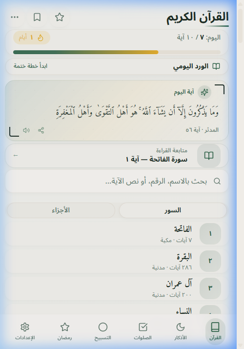
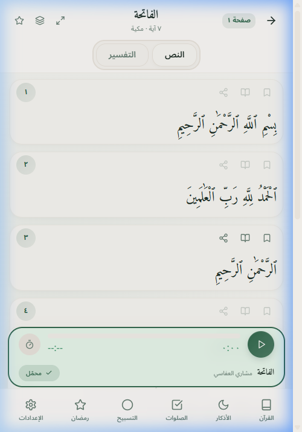
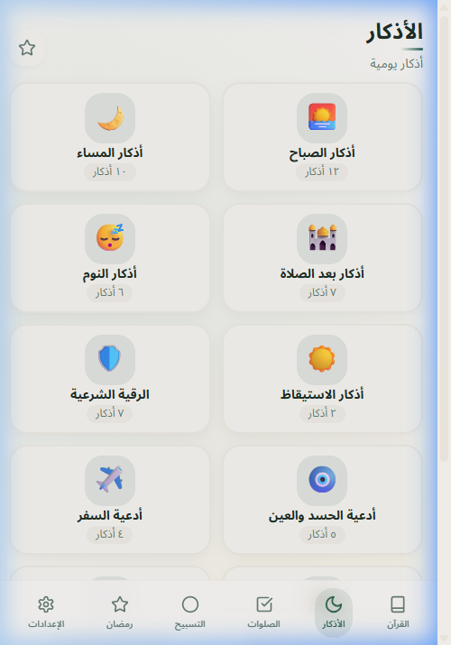
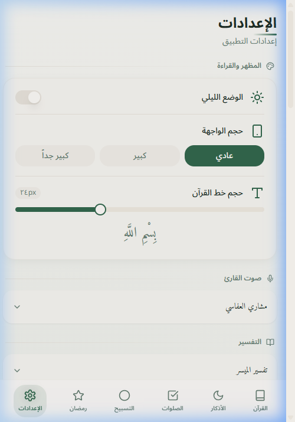

<p align="center">
  <a href="https://quran.thewise.cloud">
    
  </a>
</p>

<h1 align="center">Wise Quran — القرآن الكريم</h1>

<p align="center">
  <strong>A modern, offline-first Quran app for a beautiful and distraction-free reading experience.</strong>
</p>

<p align="center">
  <a href="https://quran.thewise.cloud"><strong>Live Demo: quran.thewise.cloud</strong></a>
</p>

<p align="center">
  
  
  
  
</p>

<p align="center">
  <a href="#-key-features">Key Features</a> •
  <a href="#-tech-stack">Tech Stack</a> •
  <a href="#-development">Development</a> •
  <a href="CONTRIBUTING.md">Contributing</a>
</p>

<p align="center">
  
  
  
  
</p>

## 📖 About The Project

Wise Quran is a fast, beautiful, and distraction-free app for reading the Quran, listening to recitations, and tracking your spiritual habits. It's built as a Progressive Web App (PWA) with a strong emphasis on offline-first functionality—once you download a Surah or audio file, it works permanently without an internet connection.

## ✨ Key Features

### Core Quran Experience
- **Full Quran Reading:** Clean, readable Uthmanic typography for all 114 Surahs.
- **Audio Recitations:** Listen to multiple reciters with verse-by-verse highlighting.
- **Advanced Search:** Instantly search within any Surah with highlighted results.
- **Translations & Tafsir:** Access to over 12 translations and detailed tafsir.
- **Ayah Bookmarking & Sharing:** Bookmark verses and generate beautiful shareable cards.

### Spiritual Tools
- **Prayer Times & Tracker:** Get local prayer times and log your daily prayers to build streaks.
- **Adhan Notifications:** Timely notifications for prayer times with beautiful Adhan audio.
- **Qibla Compass:** An AR-style 3D compass to find the Qibla direction.
- **Azkar & Duas:** Morning, evening, and post-prayer remembrances with progress tracking.
- **Digital Tasbeeh:** A simple and elegant tap counter with haptic feedback.

### Learning & Memorization
- **Hifz Tracking:** A comprehensive grid system to track your Quran memorization (Hifz) progress.
- **Recitation Testing:** Test your memorization with a dedicated tool.
- **Reading Statistics:** Track your reading history, streaks, and achievements.
- **Daily Reading Goals:** Set and track daily reading goals to stay consistent.

### Modern Technology
- **Offline First (PWA):** Installable on iOS & Android. Download text and audio for true offline access.
- **Cloud Sync:** Create an account to sync your bookmarks, progress, and settings across devices.
- **Sleep Mode:** Listen to recitations with a smart timer, gradual fade-out, and soothing background nature sounds.
- **Theming:** A stunning, animated dark mode and multiple UI scaling options for accessibility.

## 🛠️ Tech Stack

- **UI Framework:** React 18 + TypeScript
- **Build Tool:** Vite with `vite-plugin-pwa` for PWA capabilities
- **Offline & Caching:** Workbox and IndexedDB for offline storage of text, audio, and tafsir.
- **Styling:** Tailwind CSS with a custom component library built on `shadcn/ui`.
- **Animations:** Framer Motion
- **Deployment:** Continuous deployment to Hostinger via GitHub Actions.

## 🚀 Development

To set up and run this project locally, follow these steps:

1.  **Clone the repository:**
    ```bash
    git clone https://github.com/iammagdy/wisequran.git
    cd wisequran
    ```

2.  **Install dependencies using pnpm:**
    ```bash
    pnpm install
    ```

3.  **Run the development server:**
    This will start the app on `http://localhost:5173`.
    ```bash
    pnpm run dev
    ```

4.  **Build for production:**
    ```bash
    pnpm run build
    ```

## 🙏 Acknowledgments

- **APIs:** Quran data and audio from [Quran.com API](https://quran.com) and [Alquran Cloud](https://alquran.cloud). Prayer times powered by [Aladhan API](https://aladhan.com).
- **AI Collaboration:** This project was developed with AI pair programming assistance from **Claude** (Anthropic) and **Gemini** (Google), who were instrumental in architecture, UI/UX design, and implementing the offline capabilities.

## 📄 License

This project is licensed under the MIT License. See the [LICENSE](LICENSE) file for details.
